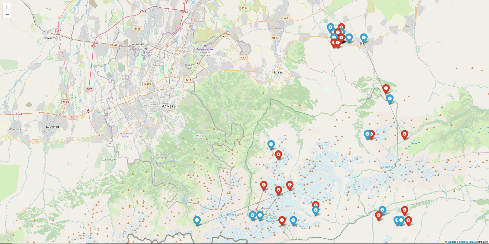

# Project Description
This code took the **5th** place in the 'KBTU Data Camp 2025'. 

The contest was held on the **kaggle** platform. 

The data was taken from there. 

*Made by Alexey V.*

# Task description
## Purpose

My task is to predict the ** first aftershock** for each major earthquake in the test set. And output the data to a csv file for the organizers.

## Columns
**id_eq** - the unique identifier of the main earthquake

**year**, **month**, **day**, **hour**, **min**, **sec** — time of the main earthquake

**lat**, **lon** — location (latitude and longitude) of the main earthquake

**depth** — depth of the main earthquake in kilometers

**class** — energy class (magnitude index) of the main earthquake

**year_as**, **month_as**, **day_as**, **hour_as**, **min_as**, **sec_as** — time of the first aftershock

**lat_as**, **lon_as** — location (latitude and longitude) of the aftershock

**depth_as** — depth of the aftershock in kilometers

**class_as** — energy class (proxy based on magnitude) of the aftershock

 ## Tasks
 * Prepare data for training
 * Train the model
 * Predict and prepare the final data

# Table of contents

## Map visualization

